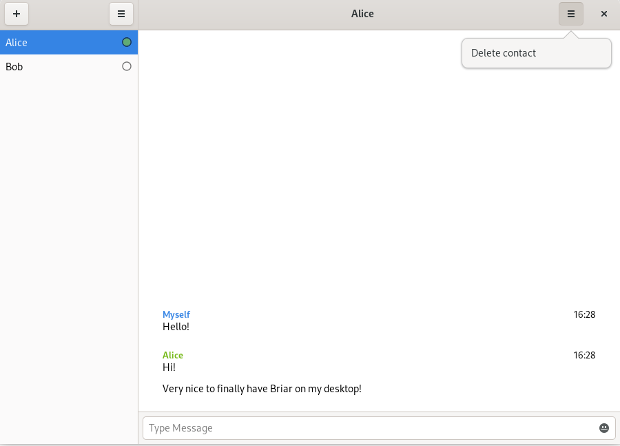

# Briar GTK

[](https://code.briarproject.org/briar/briar-gtk/commits/main)
[](https://code.briarproject.org/briar/briar-gtk/commits/main)

Note: Briar GTK is about to get replaced by [Briar Desktop](https://code.briarproject.org/briar/briar-desktop/) and is therefore no longer under development.

A GTK app for [Briar](https://briar.app), bringing secure messaging to your desktop and mobile devices.
It uses [briar_wrapper](https://code.briarproject.org/briar/python-briar-wrapper) and the
[Briar REST API](https://code.briarproject.org/briar/briar/blob/master/briar-headless/README.md)
and therefore requires Java and Python.
Currently, it only supports private chats and requires a x86 Linux.



For regular updates, check out the Briar tag on
[Nico Alt's blog](https://nico.dorfbrunnen.eu/tags/briar/)
([RSS feed](https://nico.dorfbrunnen.eu/tags/briar/index.xml))
and watch the
[milestones of this repo](https://code.briarproject.org/briar/briar-gtk/-/milestones).

## Installation

We plan to distribute Briar via Debian (and related distributions) as _.deb_ and
via [Flathub.org](https://flathub.org/home) as flatpak, but until now, there are
only semi-official installation methods available. You might want to use them now
for not having to wait, but please note that those installation methods will be deprecated
once Briar is available in Debian and Flathub.org.

### Flatpak

Briar GTK can be installed using Flatpak.
After [installing Flatpak](https://flatpak.org/setup/), you can install
Briar GTK like this:
```
flatpak install --user https://flatpak.dorfbrunnen.eu/repo/appstream/app.briar.gtk.flatpakref
```

In case the above command doesn't work for you, you can try to install it manually:
```
flatpak remote-add --if-not-exists flathub https://flathub.org/repo/flathub.flatpakrepo
flatpak remote-add --if-not-exists dorfbrunnen https://flatpak.dorfbrunnen.eu/repo/dorfbrunnen.flatpakrepo
flatpak install --user app.briar.gtk
```

#### Running

After installing Briar GTK, you can run it like this: 
```
flatpak run app.briar.gtk
```

### Debian Bullseye

At [media.dorfbrunnen.eu/briar/debs](https://media.dorfbrunnen.eu/briar/debs/)
_.deb_ files are available to install Briar GTK on Debian Bullseye (currently
_testing_). From its readme:

> Similar to the jars/ folder, I will upload .deb packages of Briar GTK here until Briar is included in Debian main.
>
> To verify the signatures, first download my PGP key:
>
> https://keys.openpgp.org/vks/v1/by-fingerprint/558BE9071CA6CA44DBF5576B95A0DAF7DBC7B548
>
> Then, import my key into your key ring:
>
> `gpg --import 558BE9071CA6CA44DBF5576B95A0DAF7DBC7B548`
>
> Finally, verify that the files match the signatures:
>
> `gpg --verify briar-gtk-latest.deb.sig briar-gtk-latest.deb`
>
> Before installing the .debs, please make sure to uninstall any other versions of Briar related software on your device, e.g. `briar_wrapper` from pip.
>
> You can then proceed to installing the .deb's:
>
> `sudo apt install ./*.deb`

### Arch Linux

Arch Linux users can use the [`briar-gtk` package from AUR](https://aur.archlinux.org/packages/briar-gtk/) to install Briar GTK and its dependencies.

## Developers

### GNOME Builder

The easiest and most convenient way to build _briar-gtk_ is by using
[Builder](https://wiki.gnome.org/Apps/Builder).
Because Flatpak support is quite new in Builder,
it's recommend to install Builder via Flatpak:
```
flatpak install flathub org.gnome.Builder
```
To setup Flatpak on your system, check out the
[documentation at flatpak.org](https://flatpak.org/setup/).
In _Builder_, click "Clone Repository" at the bottom and
enter the URL to this Git project.

### flatpak-builder

To build it on the command-line without Builder, call this:
```bash
flatpak remote-add --user --if-not-exists flathub https://flathub.org/repo/flathub.flatpakrepo
flatpak-builder --install-deps-from=flathub --user --install --force-clean --ccache flatpak-builddir app.briar.gtk.json
flatpak run app.briar.gtk
```

### Directly from source

_Warning: This hasn't been tested yet._

After cloning this Git repository, don't forget to initialize the briar-wrapper submodule:
```
git submodule update --init
```

First, install some Debian dependencies:
```
sudo apt install meson libhandy-1-dev gettext appstream-util python3-pip
```

On Fedora, you can call:
```
sudo dnf install meson gtk3-devel libhandy-devel gettext libappstream-glib python3-pip
```

Then, install the Python dependencies:
```
pip3 install -r requirements.txt
```

You also need to build
[Briar Headless](https://code.briarproject.org/briar/briar/-/tree/master/briar-headless).
Check its readme to learn how to do it. You can also use
builds provided by The Briar Project, e.g.
[briarproject.org/jar/briar-headless-1.2.14.jar](https://briarproject.org/jar/briar-headless-1.2.14.jar),
and put the .jar file at _~/.local/share/java/briar-headless.jar_.
Make sure to have _java_ (e.g. `openjdk-11-jdk`) installed.

Once you've done this, change the path to the Briar headless
jar in [briar_gtk.define](briar-gtk/briar_gtk/define.py) and
build Briar GTK with _meson_ and _ninja_:
```
meson --prefix $PWD/_install _build
ninja -C _build all install
```

You should then be able to run Briar GTK like this:
```
XDG_DATA_DIRS=_install/share:$XDG_DATA_DIRS ./_install/bin/briar-gtk
```

### Debian
First, install some Debian dependencies:
```
sudo apt install build-essential devscripts debhelper gnome-pkg-tools python3-all meson libhandy-1-dev gettext appstream-util
```

You can then build the .deb like this:
```
debuild -us -uc
```

And install the .deb like this:
```
sudo dpkg -i ../briar-gtk_0.1.0-beta1-1_all.deb
```

## Translations

See [TRANSLATION.md](./TRANSLATION.md) for more information.

## Maintenance

From time to time, translations and Flatpak's Python dependencies should be
updated. The former can be done with
`tools/update-translations.sh`, the latter using
[flatpak-builder-tools](https://github.com/flatpak/flatpak-builder-tools).

## Design Goals

* Intuitive UI, similar to Briar Android client
* Main platform is GNU/Linux, but should also support (at least) Windows and macOS
* Analogously, main platform is x86, but should also support (at least) arm
* Follows [GNOME Human Interface Guidelines](https://developer.gnome.org/hig/stable/)
* Adaptive to different screen sizes (desktop and mobile devices)
* Has [phone constraints](https://developer.puri.sm/Librem5/Apps/Guides/Design/Constraints.html) in mind
* Strictly separates API wrapper from GTK stuff, making former a solid base for other (commandline) clients

## FAQ

### How can I let Briar start automatically at system boot?

Until [#66](https://code.briarproject.org/briar/briar-gtk/-/issues/66) is resolved, you can manually
tell your desktop environment to start Briar by creating the following file:

_.config/autostart/briar-gtk.desktop_
```
[Desktop Entry]
Type=Application
Name=briar-gtk
Exec=/usr/bin/briar-gtk
```

If you're using Flatpak, you need to change `Exec` to `/usr/bin/flatpak run app.briar.gtk`.

### How can I run this on the PinePhone/Librem 5?

Good news: Briar GTK runs on mobile devices like PinePhone and Librem 5.
However, there's no official installation method yet, so you have to build it
yourself. See [the Flatpak Builder section](#flatpak-builder) for more information.

---

For more questions, take a look at
[the FAQ of python-briar-wrapper](https://code.briarproject.org/briar/python-briar-wrapper/blob/main/README.md#faq).

## License

This program is free software: you can redistribute it and/or modify
it under the terms of the GNU Affero General Public License as
published by the Free Software Foundation, either version 3 of the
License, or (at your option) any later version.

This program is distributed in the hope that it will be useful,
but WITHOUT ANY WARRANTY; without even the implied warranty of
MERCHANTABILITY or FITNESS FOR A PARTICULAR PURPOSE.  See the
[GNU Affero General Public License](LICENSE.md) for more details.
